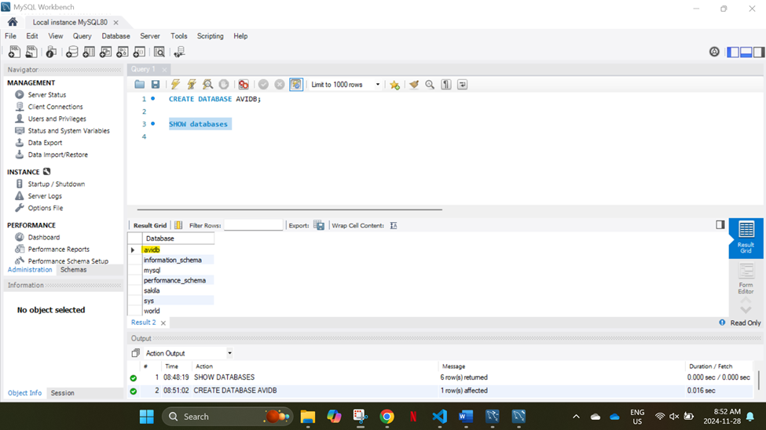
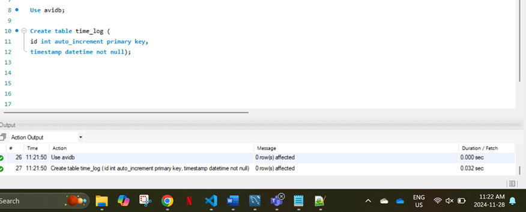
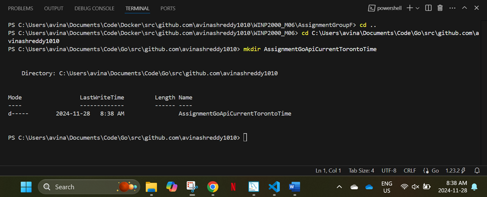
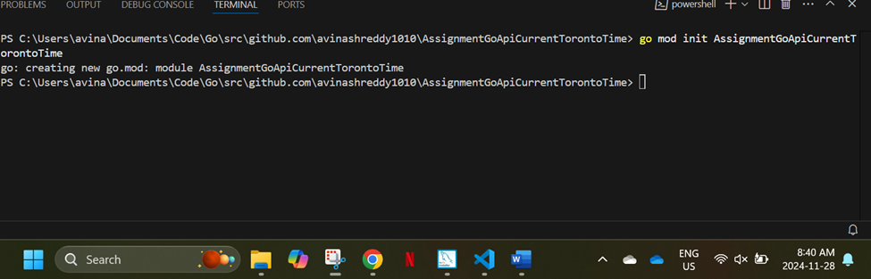
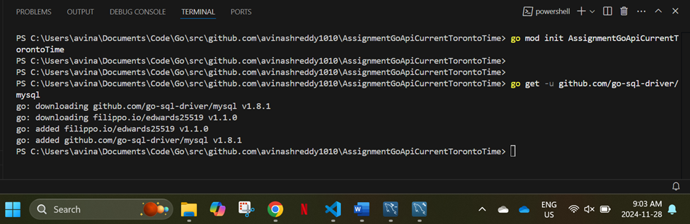
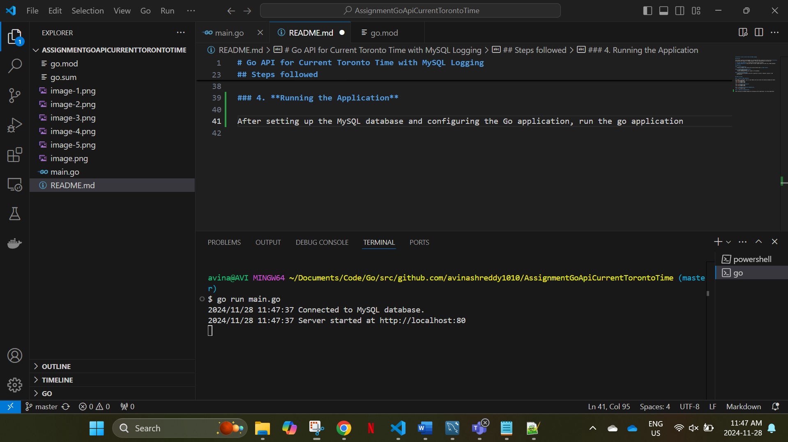
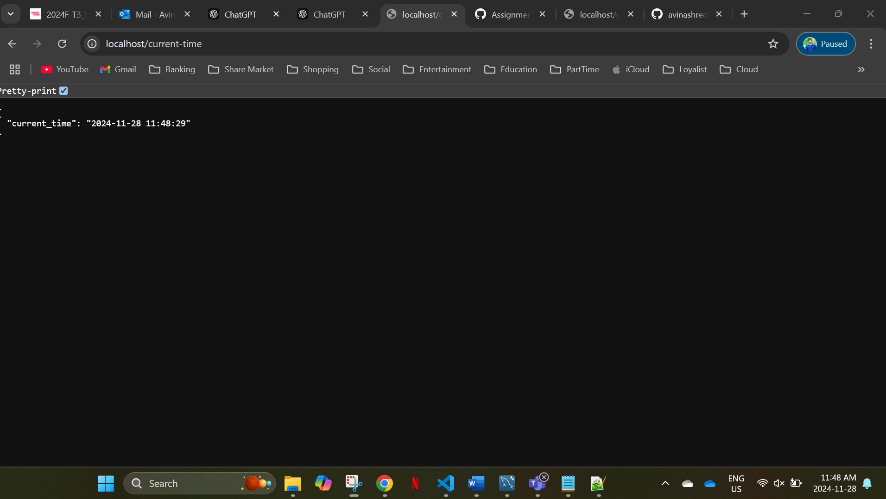
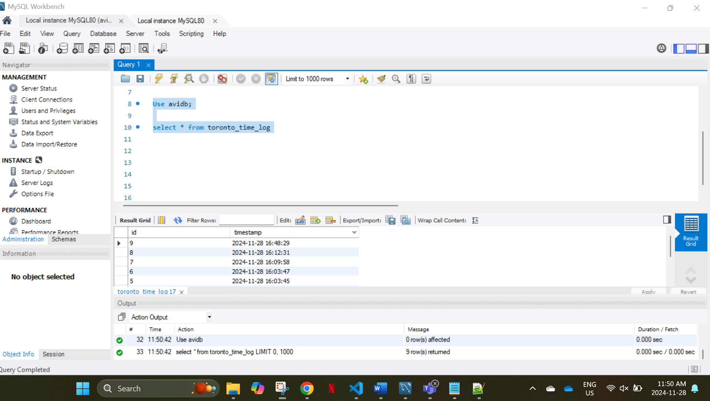

# Go API for Current Toronto Time with MySQL Logging

## Overview

This project involves the development of a Go-based API that provides the current time in **Toronto**, and logs each API request to a MySQL database. The main functionalities of the API are:

1. **Current Time Endpoint**: It returns the current time in Toronto.
2. **Logging Endpoint**: It logs the time for every request made to the API into a MySQL database.

## Objectives

### 1. **Go API Endpoint**:
   - Build an endpoint that returns the current Toronto time in **JSON format**.

### 2. **MySQL Database Integration**:
   - Set up a MySQL database.
   - Log the timestamp of each API request in the database.

### 3. **Time Zone Handling**:
   - Ensure the time returned by the API is adjusted to Toronto's timezone, using Go's time functionality.

## Steps followed

### 1. **Install MySQL Database**

Once MySQL is installed, log in to your MySQL server and create the necessary database and table:

### 2. **Initialise the project**

### 3. **Installed the required dependencies**

### 4. **Running the Application**

After setting up the MySQL database and configuring the Go application, run the go application

### 5. **Redirect to http://localhost/current-time in web browser**

### 6. **Open MySQL and run select command which should insert the current time into the table**

### 7. Conclusion

This project demonstrates the creation of a Go-based API that provides the current time in Toronto, adjusted to the **Eastern Standard Time (EST)** timezone, and logs each request to a **MySQL** database. The key objectives were successfully achieved:

- **Timezone Handling**: The application correctly retrieves and converts the time to Toronto's local timezone (`America/Toronto`), ensuring accurate time representation.
- **Database Integration**: Each time request is logged into the MySQL database, allowing persistent storage of the time data.
- **Error Handling**: The application includes error handling for both database connection failures and time zone loading issues, ensuring stability during runtime.
  
### Key Achievements:
- **API Endpoints**: Two main endpoints were created:
  - `/current-time`: Returns the current time in Toronto in JSON format.
  - `/time-logs`: Retrieves all logged times from the MySQL database.
  
- **Database Logging**: Every time request is logged to a MySQL database, making it easy to track past requests.

Overall, this Go API project demonstrates how to handle time zone conversions, connect to a MySQL database, and provide a simple yet functional API with basic logging capabilities. This foundation can be expanded with more complex features as needed.
