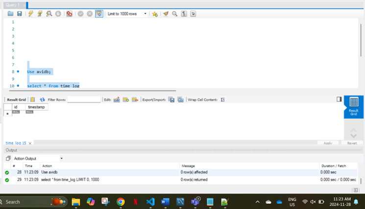

# Go API for Current Toronto Time with MySQL Logging

## Overview

This project involves the development of a Go-based API that provides the current time in **Toronto**, and logs each API request to a MySQL database. The main functionalities of the API are:

1. **Current Time Endpoint**: It returns the current time in Toronto.
2. **Logging Endpoint**: It logs the time for every request made to the API into a MySQL database.

## Objectives

### 1. **Go API Endpoint**:
   - Build an endpoint that returns the current Toronto time in **JSON format**.

### 2. **MySQL Database Integration**:
   - Set up a MySQL database.
   - Log the timestamp of each API request in the database.

### 3. **Time Zone Handling**:
   - Ensure the time returned by the API is adjusted to Toronto's timezone, using Go's time functionality.

## Steps followed

### 1. **Install MySQL Database**

Once MySQL is installed, log in to your MySQL server and create the necessary database and table:

### 2. **Initialise the project**

### 3. **Installed the required dependencies**

